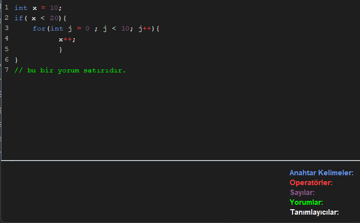

# SyntaxHighlighterApp

Java ile geliştirilmiş basit ve **gerçek zamanlı sözdizimi vurgulayıcı (syntax highlighter)**. Swing kütüphanesi kullanılarak yapılmıştır. Gerçek zamanlı olarak kod yazarken;

- Anahtar kelimeler (keywords)
- Operatörler
- Sayılar
- Yorum satırları
- Tanımlayıcılar (identifiers)

gibi yapılar farklı renklerle vurgulanır. Ayrıca sol tarafta satır numaraları gösterilir ve ekranın altında bir **renk efsanesi (legend panel)** yer alır.

---

## Özellikler

-  Gerçek zamanlı sözdizimi vurgulama
-  Java Swing tabanlı GUI
-  Satır numaraları gösterimi
-  Token tabanlı lexer ve basit top-down parser
-  Temiz ve koyu tema arayüz

---

## Ekran Görüntüsü

---

##  Kurulum ve Çalıştırma
-	Kodu bir Java IDE'sine (örneğin, IntelliJ IDEA, Eclipse) veya metin editörüne kopyalayın.
-	SyntaxHighlighterApp.java dosyasını derleyin ve çalıştırın:
-	Uygulama, 600x400 piksel boyutlarında bir pencere açar.

## Tanıtım Videosu 
Uygulamanın kısa tanıtım videosu:  
[Tanıtım Videosu]([https://youtu.be/6miwVdFR8wI](https://youtu.be/gDscnBPHctk))

## Ugulama Hakkında
Projem hakkıbda yazdığım yazımı buradan okuyabilirsiniz:  
[Java ile Gerçek Zamanlı Sözdizimi Vurgulayıcısı](https://medium.com/@hsyn20052018/kodu-renkli-g%C3%B6relim-java-ile-ger%C3%A7ek-zamanl%C4%B1-s%C3%B6zdizimi-vurgulay%C4%B1c%C4%B1-30e4b38545e0)

